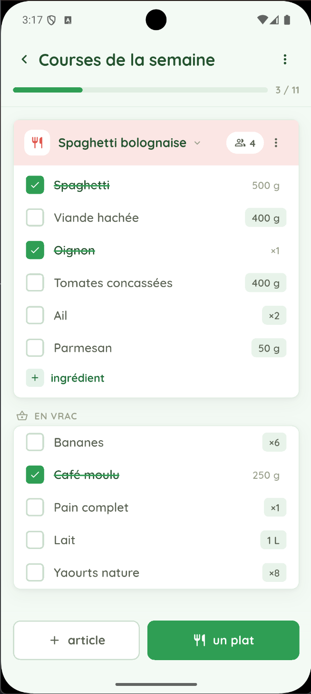
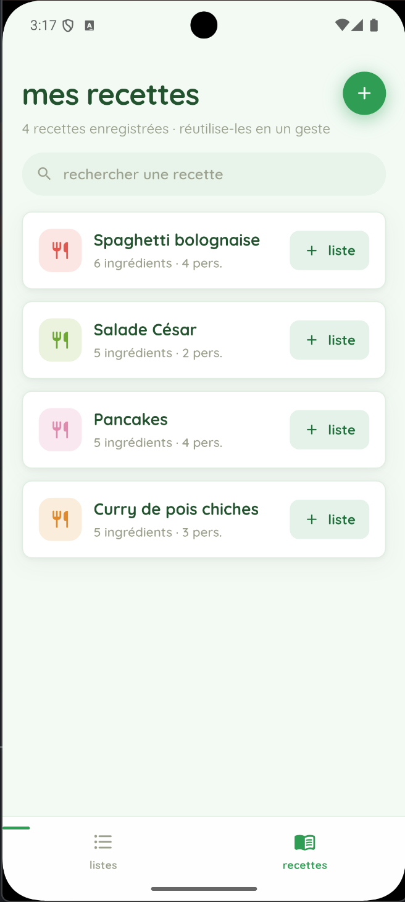

# Listeo

Flutter mobile app to create, save & edit grocery lists easily — a high-fidelity port of the `Listeo-autonome.html` prototype.

Two tabs, swipeable left↔right: **Listes** (your shopping lists) and **Recettes** (a reusable recipe library). Recipes drop into a list as a "folder" whose quantities scale live with the number of servings; loose items live in an *En vrac* section. Everything persists locally.

## Screenshots

<p align="center">
  
  &nbsp;&nbsp;
  
</p>

## Getting started

This repo contains the Dart source (`lib/`), `pubspec.yaml`, and analysis config. The platform runner folders (`android/`, `ios/`, …) are not committed, so generate them once:

```bash
cd listeo
flutter create .          # adds android/ios/etc — keeps lib/ and pubspec.yaml
flutter pub get
flutter run
```

Requires Flutter 3.19+ (Dart SDK ≥ 3.3). First launch fetches the **Quicksand** font via `google_fonts` (needs network once; it then caches). To ship fully offline, drop the Quicksand `.ttf` files into `assets/fonts/`, declare them in `pubspec.yaml`, and swap the `GoogleFonts.quicksand(...)` calls in `lib/theme/app_theme.dart` for a bundled family.

## Architecture

```
lib/
  main.dart                     app entry, Provider wiring, system UI
  theme/app_theme.dart          design tokens (colors, tones, radius, motion) — the single place to retheme
  models/
    unit.dart                   units + quantity scaling/formatting (French decimals)
    models.dart                 Item / Block / ShoppingList / Recipe + transforms, progress, relative time
  data/
    seed.dart                   seed recipes + lists
    store.dart                  AppStore (ChangeNotifier): all state + actions + shared_preferences persistence
  widgets/
    primitives.dart             Pressable, animated checkbox, qty chip, stepper, buttons, text fields, unit chips
    animations.dart             FadeSlideIn (staggered entrance), ProgressBar (tweened)
    recipe_editor.dart          reusable recipe/dish editor
    sheets.dart                 every bottom-sheet flow (create list, add item/dish, edit, menus, confirm…)
    toast.dart                  overlay toast
    nav.dart                    list-detail route with slide+fade transition
  screens/
    root_scaffold.dart          swipeable PageView + frosted bottom nav whose indicator tracks the swipe
    home_screen.dart            "mes listes"
    recipes_screen.dart         "mes recettes"
    list_detail_screen.dart     a single list: recipe folders, live servings, loose items, progress
```

State is a single `AppStore` exposed via `provider`. Screens `watch` it; actions mutate and persist.

## Notable animations

- **Swipe between tabs** — `PageView` with a bottom-nav indicator and icon colors that interpolate continuously with the drag.
- Staggered fade-and-rise entrance for list/recipe cards.
- Spring (`elasticOut`) checkmark, animated strikethrough on checked items.
- Tweened progress bars, animated serving-count rolls, collapsible recipe folders (`AnimatedSize`), slide-up sheets, and a slide-up toast.

## Theming

The default look (menthe background, leaf-green + bloc-yellow palette, Quicksand, 10px radius) lives entirely in `lib/theme/app_theme.dart` as named constants. Change them there to restyle the whole app.
